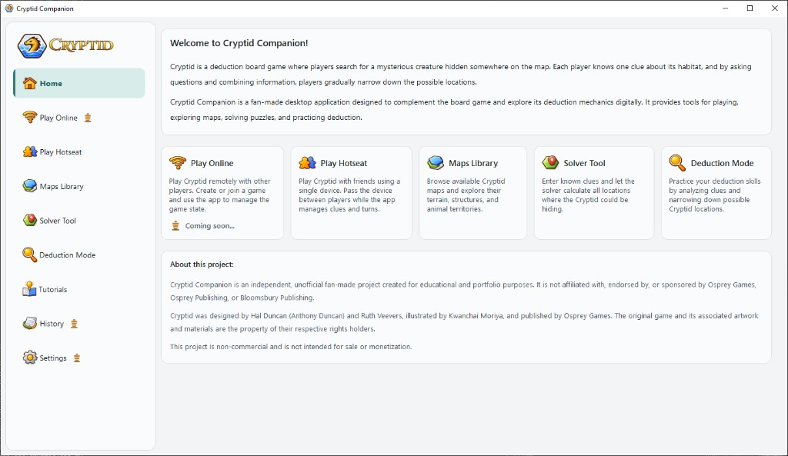
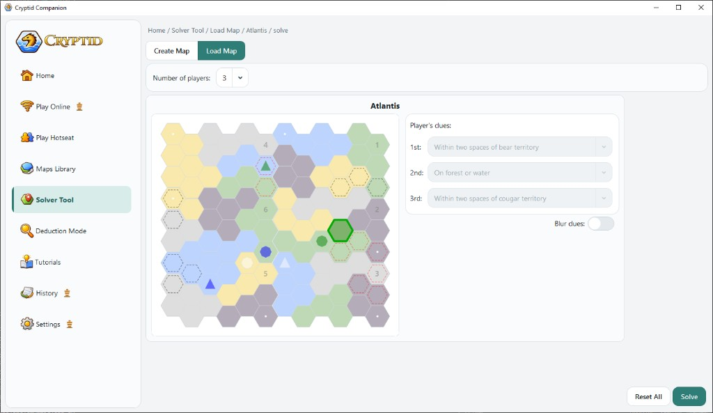
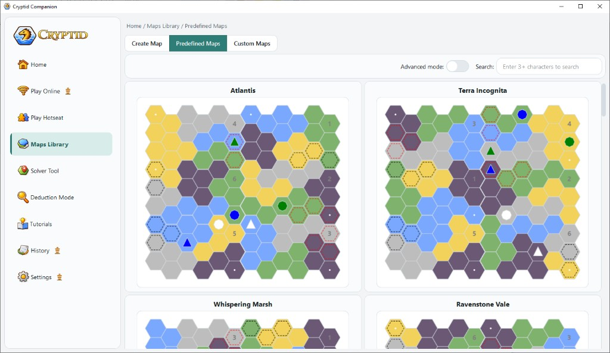
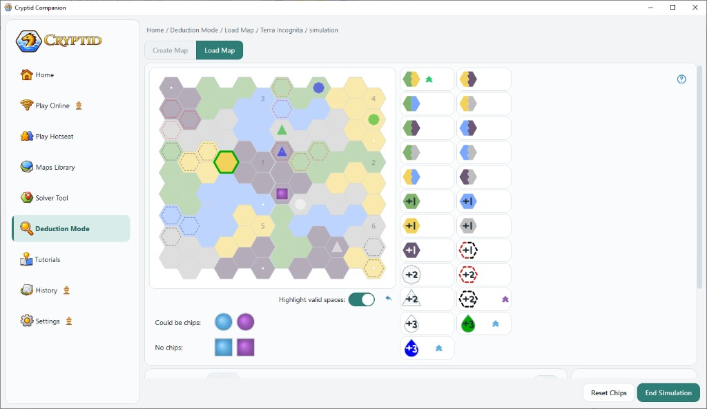
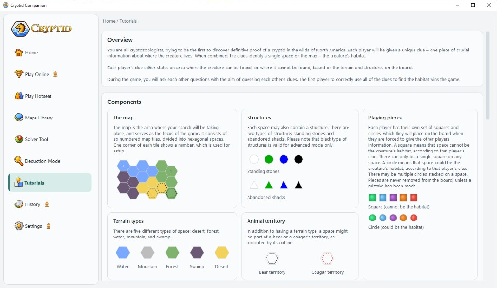
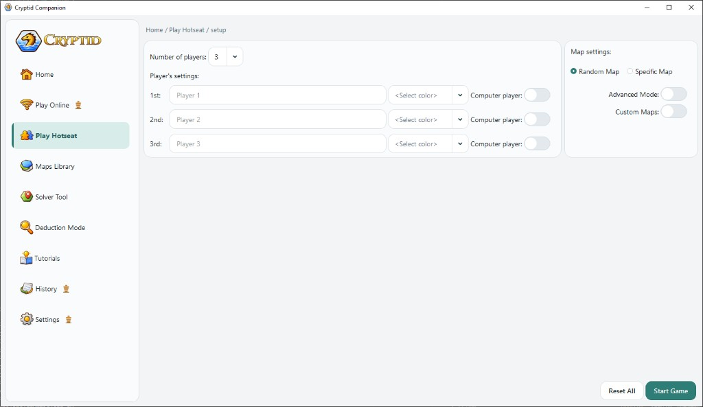
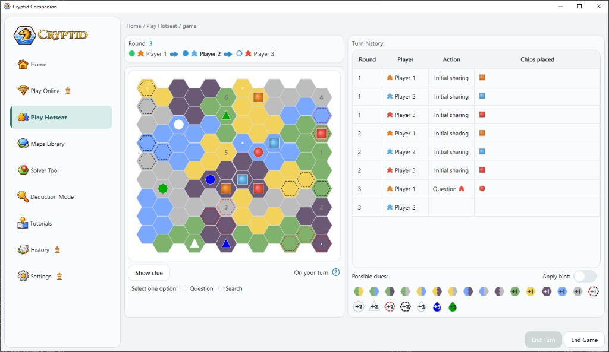

# CryptidCompanion

**Cryptid Companion** is an unofficial desktop companion for the [Cryptid](https://ospreypublishing.com/cryptid) deduction board game.

Cryptid Companion helps you set up maps, explore clues, run deductions, play hotseat on one device, and learn the rules — without replacing the physical board game.

> **Naming:** the app UI uses **Cryptid Companion** (with a space). The repository, executable, and package name use **CryptidCompanion** (no space).

[](https://www.python.org/)
[](https://doc.qt.io/qtforpython/)
[](https://github.com/katerynapuzyrna/cryptid-companion/actions/workflows/ci.yml)
[](LICENSE)

## Download

**Windows:** [Latest release](https://github.com/katerynapuzyrna/cryptid-companion/releases/latest) — download `CryptidCompanion.exe` (no install required).

Built automatically when a version tag (`v*.*.*`) is pushed. See [docs/PUBLISHING.md](docs/PUBLISHING.md) for release instructions.

---

| Home | Solver Tool |
|:---:|:---:|
|  |  |

| Maps Library | Deduction Mode |
|:---:|:---:|
|  |  |

| Tutorials | |
|:---:|:---:|
|  | |

| Play Hotseat — setup | Play Hotseat — game |
|:---:|:---:|
|  |  |

---

## Features

### Available now

| Module | Description |
|--------|-------------|
| **Maps Library** | Browse predefined and custom maps; inspect terrain, structures, and animal territories |
| **Solver Tool** | Enter player clues and highlight hexes where the Cryptid habitat must be |
| **Deduction Mode** | Practice deduction with clue chips, simulations, and valid-clue analysis |
| **Play Hotseat** | Pass-and-play on one device — turns, clues, squares/circles, and board state |
| **Tutorials** | Interactive guide: components, clue types, setup, and gameplay rules |
| **Custom maps** | Create, save, and edit custom map configurations |

### Quality & testing

| Area | Description |
|------|-------------|
| **Unit tests** | `tests/unit/logic/` — clues, conditions, map loader, clue grid |
| **Integration tests** | Every predefined map in `maps.json` validated for 3–5 players |
| **CI** | GitHub Actions on Python 3.11 and 3.12 ([`.github/workflows/ci.yml`](.github/workflows/ci.yml)) |

Run locally: `tools\pre_push_check.bat` or see [Testing](#testing) below.

### Planned

- **Play Online** — remote multiplayer game state management
- **History** — session history and replay
- **Settings** — user preferences
- **Manual QA checklist** — documented regression flows
- **UI automation** — critical-path smoke tests
- **ML-assisted deduction** — candidate ranking and clue analysis (experimental)

---

## Tech stack

- **Language:** Python 3.11+
- **Desktop UI:** PySide6 (Qt 6), Qt Designer `.ui` files, QSS stylesheets
- **Logic / maps:** NumPy and SciPy rules engine, JSON map data
- **Packaging:** PyInstaller (Windows executable)

---

## Quick start

### Prerequisites

- Python 3.11 or newer
- Windows (primary target; PySide6 also runs on macOS/Linux for development)

### Run from source

```bash
git clone https://github.com/katerynapuzyrna/cryptid-companion.git
cd cryptid-companion

python -m venv .venv
.venv\Scripts\activate          # Windows
# source .venv/bin/activate     # macOS / Linux

pip install -r requirements.txt

# Optional: create local custom maps file (gitignored; auto-created on first app run)
copy src\cryptid\data\custom_maps.example.json src\cryptid\data\custom_maps.json

cd src/cryptid
python app.py
```

### Qt resources

`src/cryptid/resources_rc.py` is **committed** so a fresh clone runs without an extra build step. It is generated from `resources.qrc` (icons and other bundled assets).

Regenerate it only after you add, remove, or rename files listed in `resources.qrc`:

```bash
cd src/cryptid
pyside6-rcc resources.qrc -o resources_rc.py
```

Then commit both `resources.qrc` and `resources_rc.py` together.

### Build Windows executable

```bash
pip install -r requirements-build.txt
build_exe.bat
```

Output: `dist/CryptidCompanion.exe` (single-file build; first launch unpacks to a temp folder).

---

## Project structure

```text
cryptid-companion/
├── src/cryptid/
│   ├── app.py              # Application entry point
│   ├── logic/              # Rules engine, clues, map loading (no UI)
│   ├── board/              # Hex board, pieces, markers, canvas
│   ├── ui/                 # Pages, shell, shared widgets
│   ├── data/               # maps.json, custom_maps.example.json, hints
│   └── assets/             # UI files, icons, QSS styles
├── tests/
│   ├── unit/logic/         # pytest unit tests
│   ├── integration/        # maps.json validation
│   └── validate_maps_intersections.py
├── docs/
│   ├── architecture.md
│   ├── PUBLISHING.md       # First push & release guide
│   └── screenshots/
├── tools/                  # pre_push_check, build helpers
├── CryptidCompanion.spec   # PyInstaller spec
└── build_exe.bat
```

Local-only (gitignored): `src/cryptid/data/custom_maps.json` — your saved custom maps.

Game rules live in `logic/` and can be tested independently of the Qt UI. See [docs/architecture.md](docs/architecture.md) for module-level detail.

---

## Architecture

```text
┌─────────────────────────────────────────┐
│  UI (PySide6)                           │
│  Home · Maps · Solve · Deduction ·      │
│  Hotseat · Tutorials                    │
└─────────────────┬───────────────────────┘
                  │
┌─────────────────▼───────────────────────┐
│  Logic layer                            │
│  conditions · clues · map_loader ·      │
│  rule_combinations · hints              │
└─────────────────┬───────────────────────┘
                  │
┌─────────────────▼───────────────────────┐
│  Data (JSON) + Board geometry           │
└─────────────────────────────────────────┘
```

Core flow for solving and highlighting:

1. Load map configuration (`maps.json` or a custom map)
2. Build board representation (`build_map_from_data`)
3. Evaluate all clue conditions (`compute_all_conditions`)
4. Intersect selected clues to find valid habitat hexes (`intersection_hexes`)

---

## Testing

### Unit tests

```bash
pip install -r requirements-dev.txt
pytest
```

CI runs on GitHub Actions (`.github/workflows/ci.yml`) for Python 3.11 and 3.12 on every push/PR to `main`.

Logic-layer tests live under `tests/unit/logic/`.

### Integration tests

Validates every predefined map in `maps.json` has exactly **one** habitat hex for 3, 4, and 5 players, using each map's configured mode (`advancedMode` → advanced rules, otherwise normal):

```bash
pytest tests/integration -v
```

Legacy script (same checks):

```bash
python tests/validate_maps_intersections.py
```

Pre-push (all of the above): `tools\pre_push_check.bat`

### Roadmap (testing)

- Manual test checklist (`docs/manual-test-checklist.md`)
- UI automation for critical paths

---

## Roadmap

| Phase | Status | Goals |
|-------|--------|--------|
| **v0.1** | Done | Public repo, README, LICENSE, reproducible dev setup |
| **v0.2** | Done | pytest suite, integration tests, GitHub Actions CI, architecture docs |
| **v0.3** | Done | GitHub Releases with `.exe`, publishing guide, custom maps template |
| **v0.4+** | Planned | Manual QA checklist, ML module, online play |

See [CHANGELOG.md](CHANGELOG.md) and [docs/PUBLISHING.md](docs/PUBLISHING.md).

---

## Disclaimer

**CryptidCompanion** is an independent, unofficial fan-made project created for educational and portfolio purposes.

It is **not** affiliated with, endorsed by, or sponsored by Osprey Games, Osprey Publishing, or Bloomsbury Publishing.

**Cryptid** was designed by Hal Duncan (Anthony Duncan) and Ruth Veevers, illustrated by Kwanchai Moriya, and published by Osprey Games. The original game and its artwork are the property of their respective rights holders.

This project is **non-commercial** and is not intended for sale or monetization. You need a copy of the official Cryptid board game to play.

---

## Credits

- Board game: Hal Duncan, Ruth Veevers · Osprey Games · art by Kwanchai Moriya
- Cryptid Companion / CryptidCompanion: [Kateryna Pushko](https://github.com/katerynapuzyrna)

---

## License

This project's source code is licensed under the [MIT License](LICENSE).

Cryptid®, game rules, and official artwork are **not** covered by this project's license and remain the property of their respective owners.
